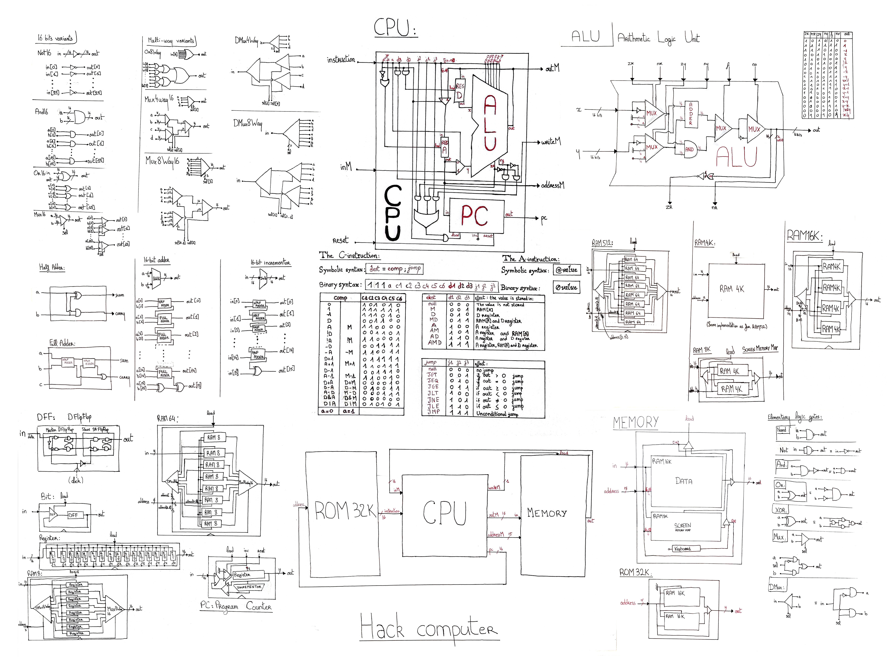

# nand2tetris
16-bit HACK Computer implementation. This repository currently contains the following projects:
- [Hardware](./hardware/README.md)
- [Assembler](./assembler/README.md)
- [Hardware Emulator](./hardware_emulator/README.md)

## Roadmap
- [x] Computer hardware
- [x] Assembler to compile .asm HACK instructions to binary
- [x] Hardware emulator to run compiled binaries
- [ ] WIP - Virtual machine above assembly language
- [ ] OS
- [ ] Compiler
- [ ] Tetris

## HACK Architecture

