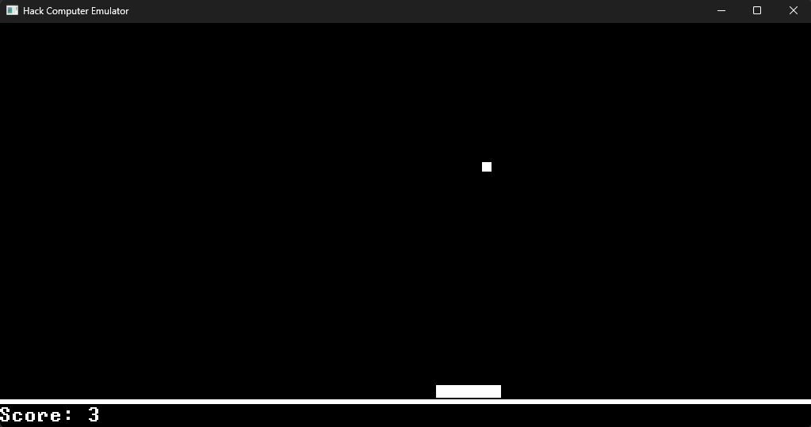

# HACK Hardware Emulator

The HACK Hardware Emulator is a software implementation of the Hack computer architecture. It is a command-line application written in Rust for maximum performance and portability. It executes HACK binaries with a cycle-accurate emulation of the Hack hardware. The CPU cycles per second can be adjusted to simulate different clock speeds.

## Building

The emulator can be built with the following command:

```bash
cargo build --release
```

The executable will be located at `target/release/hardware_emulator`.

## Usage

The emulator can be run from the command line with the following arguments:

```
Usage: hardware_emulator [OPTIONS] <HACK_FILE>

Arguments:
  <HACK_FILE>

Options:
  -c, --cpy-cycle-per-sec <CPU_CYCLES_PER_SEC>  Number of CPU cycles per second [default: 2000000]
  -h, --help                                    Print help information
  -V, --version                                 Print version information
```

## Example

The Pong.hack file, compiled using the Pong.asm file part of the nand2tetris project can be run with the following command:

```bash
hardware_emulator -c 2000000 Pong.hack
```


